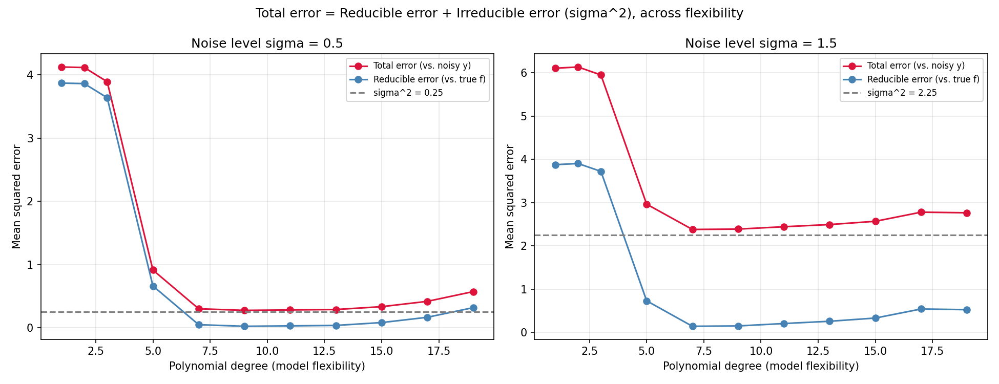

# Isolating the Irreducible Error Floor

An extension of **Unit 1, Module 1 (Function Approximation)** from
[stefanoparravano.ai](https://stefanoparravano.ai/modules/function-approximation),
built for ADEC7430, Week 2.

## The idea from the module

Statistical learning frames the world as `Y = f(X) + ε`. Any prediction
error made by an estimate `f̂` splits into two pieces:

- **Reducible error** — how far `f̂` is from the true `f`. This shrinks as
  your model gets better.
- **Irreducible error** — the variance of the noise term `ε` (`σ²`). No
  model, however good, can ever fit this away.

In real data, you never actually see this split — you never know the true
`f`, so you can't separate "my model is wrong" from "the world is just
noisy."

## The extension

This project sidesteps that limitation by choosing its own ground truth.
Because `f` and `σ²` are defined by the code itself, both error components
can be measured directly and separately, instead of just asserted:

1. Define a true nonlinear function `f(x) = 3·sin(1.3x) + 0.5x`.
2. Generate noisy training data `y = f(x) + ε`, `ε ~ N(0, σ²)`, for a known `σ`.
3. Fit polynomial regressions of increasing degree (1 through 19).
4. Evaluate every fitted model on a large held-out test set **two ways**:
   - against the *noisy* test targets → **total error** (reducible + irreducible)
   - against the *true, noiseless* `f(x)` → **reducible error only**
5. Repeat at two noise levels (`σ = 0.5` and `σ = 1.5`) to check that the
   floor moves with `σ²` while the *shape* of the reducible-error curve
   does not.

## What the result shows



- The **reducible error** (blue) traces a classic U-shape: high for
  underfit low-degree polynomials, bottoming out around degree 7–9, then
  climbing again as high-degree polynomials start overfitting the 150
  training points.
- The **total error** (red) tracks the same shape, but offset upward by
  almost exactly `σ²` at every single degree — the gap between the two
  curves stays within about 1-2% of the true noise variance across all
  11 degrees tested, at both noise levels. Printed numeric output (see
  console log below) confirms this: for `σ = 0.5` (`σ² = 0.25`), the gap
  ranges from 0.252 to 0.255 across every degree; for `σ = 1.5`
  (`σ² = 2.25`), it ranges from 2.228 to 2.239.

That gap is the irreducible error floor, made visible: however well the
model fits, that fixed amount of error never goes away, because it isn't
coming from the model at all — it's coming from the noise baked into the
data-generating process itself.

## Running it

```bash
pip install -r requirements.txt
python irreducible_error_floor.py
```

Produces `irreducible_error_floor.png` and prints the per-degree
error/gap table to the console.

## Files

- `irreducible_error_floor.py` — the experiment (data generation, model
  fitting, evaluation, plotting)
- `irreducible_error_floor.png` — the resulting figure
- `requirements.txt` — dependencies
